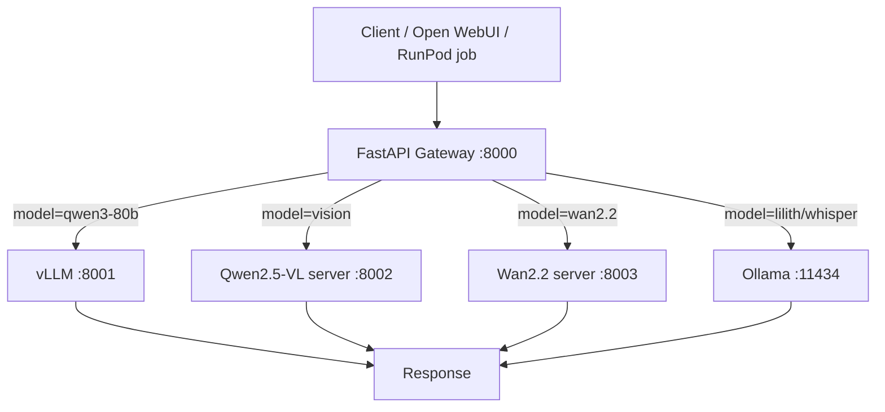

# omni-stack
Docker Build Cloud CI — builds jibbalit/omni-stack:latest on every push to main.

## Models
- Qwen3-Next-80B-A3B (vLLM)
- Qwen2.5-VL-32B (vision)
- Lilith-L3.3-70B GGUF (Ollama)
- Wan2.2 T2V-14B (video)

## FastAPI pipeline flow (gateway interconnection)
The FastAPI gateway (`gateway.py`, port `8000`) is the pipeline router between clients and model backends.

